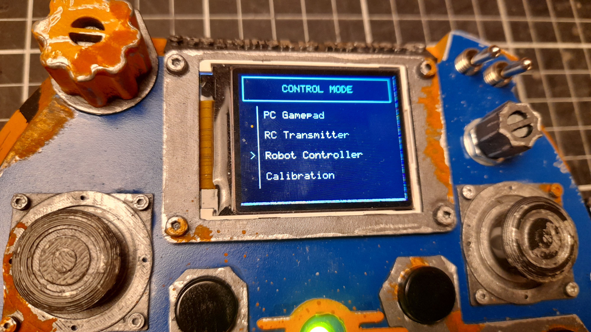

# FusionPad-32 🎮

**FusionPad-32** is an advanced, high-performance universal controller powered by the **ESP32**. It features a custom graphical interface, Hall Effect precision joysticks, buttons, switches and potentiometers.

## 🖥️ System Interface & Navigation

**FusionPad-32** runs on a modular MicroPython firmware. Upon boot, the device initializes the display and presents a selection menu. This allows the controller to be a multi-purpose tool, switching its logic without reflashing the firmware.

### 🎮 Operating Modes

The system is divided into specialized modules:

| Mode | Description |
|:---|:---|
| **🕹️ PC Gamepad** | Emulates a standard HID game controller. Optimized for low-latency gaming on PC via Bluetooth/USB. |
| **📡 RC Transmitter** | Transforms the device into a professional radio transmitter for drones or planes (supporting ESP-NOW or RF protocols). |
| **🤖 Robot Controller** | Wireless control mode designed for robotics, sending telemetry and movement commands via  ESP-NOW. Controll as many robots as You want, adding reciever Mac adress|
| **🎯 Calibration** | **Critical Tool:** A dedicated utility to map the Hall Effect sensor ranges (0-65535) and save to the internal storage. |

## 🔧 Hardware

### Core Components
* **ESP32 Microcontroller:** Main processing unit with Wi-Fi and Bluetooth connectivity
* **1.8" TFT Display (ST7735):** Real-time system monitoring and user interface
* **PCF8574 I/O Expander:** Manages 8 tactile buttons via I2C
* **2x ADS1115 ADCs:** 16-bit converters for high-resolution analog input

### Input Devices & Connections

#### 🎮 Joysticks (Hall Effect)
* **2x PS4 Joysticks** with magnetic sensors for zero-drift precision
* **Connection:** Connected to ADS1115 ADCs via I2C
* **Features:** Includes L3/R3 buttons

**ADS1 (0x48) - Joystick 1:**
- A0: Potentiometer #1
- A1: Joystick 1 - X Axis
- A2: Joystick 1 - Y Axis

**ADS2 (0x49) - Joystick 2:**
- A0: Potentiometer #2  
- A1: Joystick 2 - X Axis
- A2: Joystick 2 - Y Axis
- A3: Battery Monitoring

#### 🔘 Buttons
* **8x Tactile Switches:** Connected to PCF8574 I/O expander (I2C address 0x20)
* **4x Direct Inputs:** Connected directly to ESP32 GPIO pins

**Direct ESP32 Connections:**
- **SW 1 (L3 Button):** GPIO 14 (Internal Pull-up) - Joystick 1 click
- **SW 2 (R3 Button):** GPIO 32 (Internal Pull-up) - Joystick 2 click  
- **SW 3:** GPIO 33 (Internal Pull-up) - Toggle Switch 1
- **SW 4:** GPIO 25 (Internal Pull-up) - Toggle Switch 2

#### 🎚️ Other Controls
* **2x Rotary Potentiometers:** Connected to ADS1115 ADCs
* **2x Shoulder Bumpers:** Front-facing triggers

### 🔌 ESP32 Pin Usage

#### Display & SD Card (SPI)
| Component | ESP32 Pin | Function |
|:---|:---:|:---|
| **TFT_CS** | 5 | TFT Chip Select |
| **TFT_DC** | 27 | TFT Data/Command |
| **TFT_RST** | 4 | TFT Reset |
| **TFT_BLK** | 15 | Display Backlight |
| **SD_CS** | 13 | SD Card Chip Select |
| **SPI_SCK** | 18 | Shared SPI Clock |
| **SPI_MOSI**| 23 | Shared SPI Data Out |
| **SPI_MISO**| 19 | Shared SPI Data In |

#### I2C Bus (Peripherals)
| Signal | ESP32 Pin | Description |
|:---|:---:|:---|
| **SDA** | 21 | I2C Data Line |
| **SCL** | 22 | I2C Clock Line |

## ⚙️ Software Architecture

### 📡 Communication Protocols

#### 🎮 Bluetooth Low Energy (BLE) - Gamepad Mode
* **Protocol:** HID over BLE (Human Interface Device)
* **Implementation:** Custom BLE HID service with standard gamepad descriptor
* **Data Structure:** 16-bit button mask + 4-bit HAT switch + 6 axes (8-bit each)
* **Update Rate:** ~100Hz (10ms intervals)
* **Features:** 
  - Standard HID gamepad emulation compatible with PC, Android, iOS
  - 16 buttons, D-pad, 2 analog sticks, 2 analog triggers
  - Auto-reconnection on disconnect

#### 📡 ESP-NOW - RC Transmitter Mode  
* **Protocol:** ESP-NOW (WiFi Direct, low-latency)
* **Target:** Single receiver with predefined MAC address
* **Data Structure:** 7 channels (16-bit each) - 4 axes + 2 switches + 1 potentiometer
* **Update Rate:** 500Hz (2ms intervals) for servo control
* **Features:**
  - Ultra-low latency (<5ms) for precise servo control
  - Dual rates and trims adjustment via UI
  - Real-time channel monitoring and raw ADC display
  - Professional RC transmitter functionality

#### 📡 ESP-NOW - Robot Controller Mode
* **Protocol:** ESP-NOW with multi-receiver support
* **Target:** Multiple robots with switchable MAC addresses
* **Data Structure:** 4 joystick axes + potentiometer + screen mode + 10-bit button mask
* **Update Rate:** 50Hz (20ms intervals)
* **Features:**
  - Multi-robot control (switchable receivers)
  - Action screens for predefined robot movements
  - Real-time telemetry display
  - Flexible button mapping for robot commands

## 🚀 Quick Start
1. Power on the FusionPad-32.
2. Use potentiometr to highlight a mode.
3. Select **"Calibration"** on the first run to ensure the Hall Effect joysticks are properly centered.
4. Launch your desired mode and enjoy zero-drift precision!

## 💻 Data Acquisition (ADC) Mapping
 

The project uses two **ADS1115** (16-bit) converters to handle high-resolution analog data:

### ADS1 (Address: 0x48)
| Channel | Type | Description |
|:---:|:---|:---|
| **A0** | 🎚️ Pot | Potentiometer #1 |
| **A1** | 🕹️ Joy 1 | Axis X (Hall Effect) |
| **A2** | 🕹️ Joy 1 | Axis Y (Hall Effect) |

### ADS2 (Address: 0x49)
| Channel | Type | Description |
|:---:|:---|:---|
| **A0** | 🎚️ Pot | Potentiometer #2 |
| **A1** | 🕹️ Joy 2 | Axis X (Hall Effect) |
| **A2** | 🕹️ Joy 2 | Axis Y (Hall Effect) |
| **A3** | 🔋 Bat | Battery Monitoring |

> **Note:** The 8 tact switches are not connected directly to the ESP32 but are routed through the **PCF8574** expander at I2C address `0x20`.

