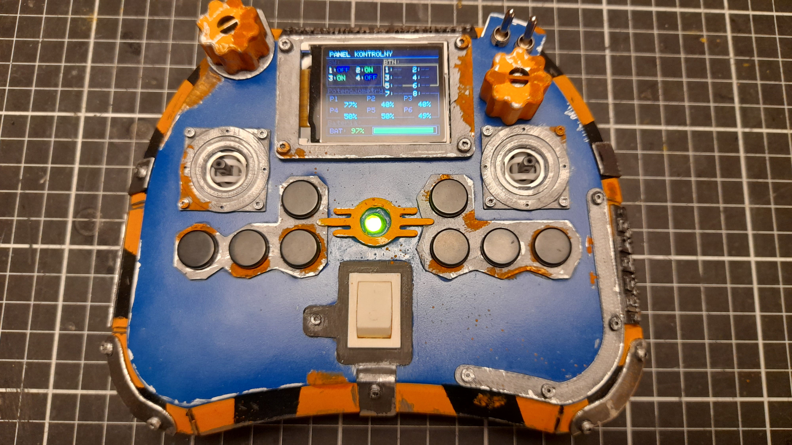
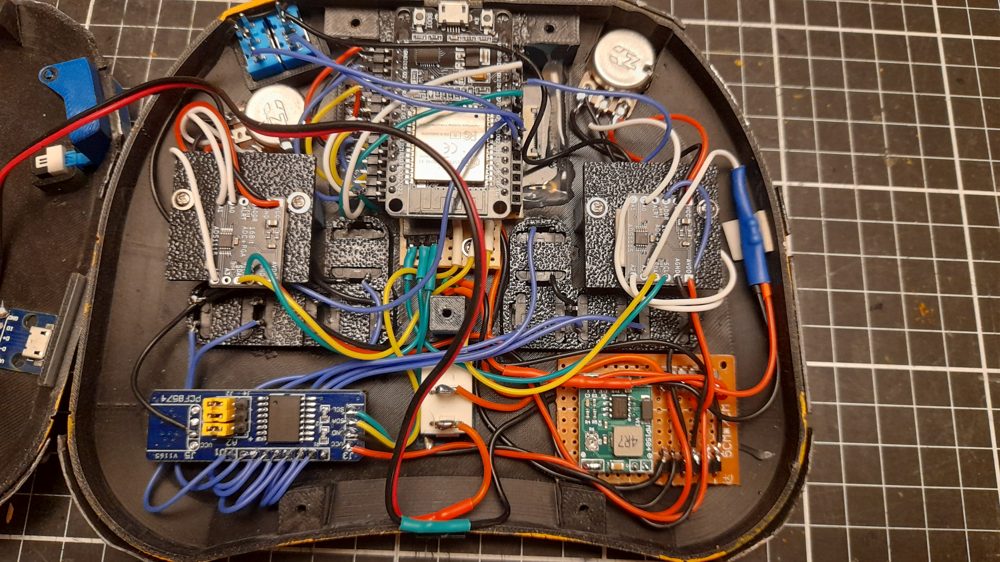
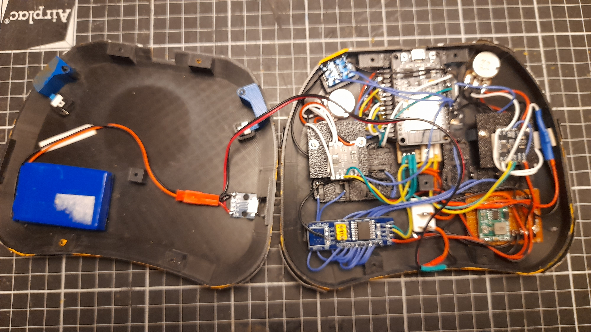
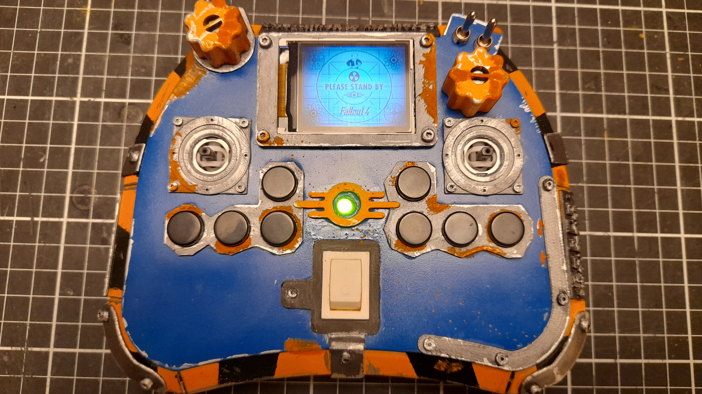
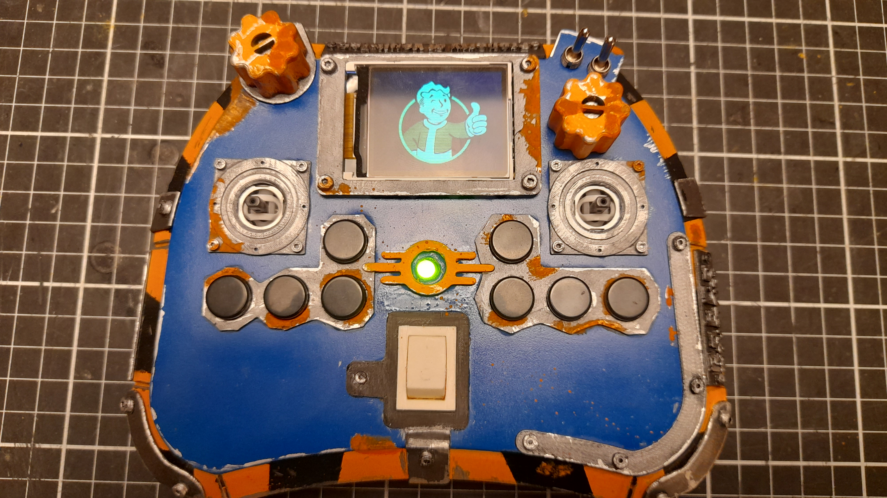

# FusionPad-32 🎮

**FusionPad-32** is an advanced, high-performance universal controller powered by the **ESP32**. It features a custom graphical interface, Hall Effect precision joysticks, buttons, switches and potentiometers.

---

## 🖥️ System Interface & Navigation

**FusionPad-32** runs on a modular MicroPython firmware. Upon boot, the device initializes the **ST7735 (Red Tab)** display in landscape mode and presents a selection menu. This allows the controller to be a multi-purpose tool, switching its logic without reflashing the firmware.

### 🎮 Operating Modes

The system is divided into specialized modules to handle different communication protocols:

| Mode | Description |
|:---|:---|
| **🕹️ PC Gamepad** | Emulates a standard HID game controller. Optimized for low-latency gaming on PC via Bluetooth/USB. |
| **📡 RC Transmitter** | Transforms the device into a professional radio transmitter for drones or planes (supporting ESP-NOW or custom RF protocols). |
| **🤖 Robot Controller** | Wireless control mode designed for robotics, sending telemetry and movement commands via UDP/TCP. |
| **🎯 Calibration** | **Critical Tool:** A dedicated utility to map the Hall Effect sensor ranges (0-65535), set deadzones, and save offsets to the internal storage. |

---

## ⚙️ Software Architecture

The project follows a modular "Plug-and-Play" script architecture to optimize RAM usage on the ESP32.

### 📡 Communication & Bus Config
* **I2C (400kHz):** High-speed bus for real-time data from dual **ADS1115** ADCs and the **PCF8574** IO expander.
* **SPI (20MHz):** High-bandwidth link for the TFT display to ensure smooth UI animations and 60FPS refresh rates.

### 📂 File Structure
* `main.py`: System entry point, initializes hardware and handles mode selection.
* `menu.py`: Graphical UI handler for the ST7735 display.
* `joystick.py` / `buttons.py`: Hardware abstraction layers for input processing.
* `mode_*.py`: Isolated logic for each specific use case.

---

## 🚀 Quick Start
1. Power on the FusionPad-32.
2. Use the navigation buttons to highlight a mode.
3. Select **"Calibration"** on the first run to ensure the Hall Effect joysticks are properly centered.
4. Launch your desired mode and enjoy zero-drift precision!

---
## 🛠️ Hardware Specifications

### Control & Inputs:
* **2x PS4 Joysticks (Hall Effect):** Magnetic sensors for zero-drift precision. Includes L3/R3 buttons.
* **2x Rotary Potentiometers:** Smooth analog dials for fine adjustments.
* **8x Tactile Switches**.
* **2x Toggle Switches:** Physical heavy-duty switches.
* **2x Shoulder Bumpers:** Front-facing triggers.

### Interface & Power:
* **1.8" TFT Display (ST7735):** Real-time system monitoring.
* **Power System:** Physical ON/OFF switch, status LED, and a **voltage divider** for battery telemetry.
* **Storage:** MicroSD slot for splash screens and data logging.

---

## 💻 Data Acquisition (ADC) Mapping
 

The project uses two **ADS1115** (16-bit) converters to handle high-resolution analog data:

### ADS1 (Address: 0x48)
| Channel | Type | Description |
|:---:|:---|:---|
| **A0** | 🎚️ Pot | Potentiometer #1 |
| **A1** | 🕹️ Joy 1 | Axis X (Hall Effect) |
| **A2** | 🕹️ Joy 1 | Axis Y (Hall Effect) |

### ADS2 (Address: 0x49)
| Channel | Type | Description |
|:---:|:---|:---|
| **A0** | 🎚️ Pot | Potentiometer #2 |
| **A1** | 🕹️ Joy 2 | Axis X (Hall Effect) |
| **A2** | 🕹️ Joy 2 | Axis Y (Hall Effect) |
| **A3** | 🔋 Bat | Battery Monitoring |

---
 

## 🔌 Full Pinout Mapping (ESP32)

Below is the complete pin configuration as defined in the source code:

### 📺 Display & SD Card (SPI)
| Component | ESP32 Pin | Function |
|:---|:---:|:---|
| **TFT_CS** | 5 | TFT Chip Select |
| **TFT_DC** | 27 | TFT Data/Command |
| **TFT_RST** | 4 | TFT Reset |
| **TFT_BLK** | 15 | Display Backlight (PWM/Digital) |
| **SD_CS** | 13 | SD Card Chip Select |
| **SPI_SCK** | 18 | Shared SPI Clock |
| **SPI_MOSI**| 23 | Shared SPI Data Out |
| **SPI_MISO**| 19 | Shared SPI Data In (SD Card) |

### 🛠️ I2C Bus (Peripherals)
*Used for both ADS1115 ADCs and the PCF8574 Expander.*
| Signal | ESP32 Pin | Description |
|:---|:---:|:---|
| **SDA** | 21 | I2C Data Line |
| **SCL** | 22 | I2C Clock Line |

### 🔘 Direct Digital Inputs (Toggle Switches / Buttons)
| Label | ESP32 Pin | Type |
|:---|:---:|:---|
| **SW 1** | 14 | Digital Input (Internal Pull-up) |
| **SW 2** | 32 | Digital Input (Internal Pull-up) |
| **SW 3** | 33 | Digital Input (Internal Pull-up) |
| **SW 4** | 25 | Digital Input (Internal Pull-up) |

---
> **Note:** The 8 tact switches are not connected directly to the ESP32 but are routed through the **PCF8574** expander at I2C address `0x20`.

